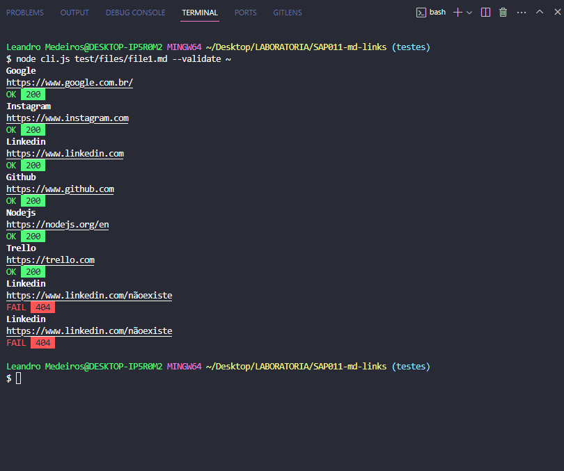

# Markdown Links - CLI e Library (Node.js)

## Índice

- [1. Prefácio]
- [2. Fluxograma]
- [3. Instalação]
- [4. Comandos no terminal]
- [5. Testes]
- [6. Checklist]

---

## Prefácio

Markdown é amplamente utilizado em diversas plataformas que lidam com textos, como GitHub, fóruns e blogs. É bastante comum encontrar arquivos nesse formato, especialmente o README.md, em muitos repositórios. Frequentemente, esses arquivos Markdown incluem links que podem estar desatualizados ou não funcionar mais, o que pode diminuir significativamente a utilidade das informações contidas neles.

Neste projeto, desenvolveu-se uma ferramenta baseada em Node.js que realiza a leitura e análise de arquivos Markdown. O objetivo é identificar e verificar links presentes nesses arquivos, fornecendo estatísticas úteis sobre eles. Essa ferramenta foi implementada como uma interface de linha de comando (CLI) e também como uma biblioteca em JavaScript, aproveitando as capacidades do Node.js.

---

## Fluxograma

.png>)

---

## Instalação

- `npm install md-links-irixalmeida`

---

## Comandos no terminal

O usuário que utilizar a ferramenta desenvolvida, poderá localizar os links em um arquivo de interesse com o comando abaixo:

- `md-links caminho-do-arquivo`
   

A segunda possibilidade de uso é inserir o comando --validate após o caminho do arquivo, para que assim a ferramenta informe os links que estão com erros.

- `md-links caminho-do-arquivo --validate`  
   

A terceira funcionalidade, é verificar informações resumidas sobre os links, acrescentando o comando --stats:

- `md-links caminho-do-arquivo --stats`  
   

Também é possível utilizar as duas opções acima, juntas:

- `md-links caminho-do-arquivo --stats --validate`
   

A ferramenta está apta a tratar os erros de arquivos não .md, exemplo:

- `md-links package.json`
   

---

## Testes

A aplicação foi finalizada com cobertura maior de 70%.
 

---

## Checklist

- ✅ Possui CLI;
- ✅ É instalável;
- ✅ Passa pelo linter;
- ✅ Passa pelos testes (npm test);
- ✅ Inclui fluxograma de estudos e tomada de decisões no README.md;
- ✅ Testes unitários cobrem um mínimo de 70% de statements, functions, lines e branches;
- [✅] Package.json: deve possuir nome, versão, descrição, autor, licença, dependências e scripts (pretest, test e etc).

---

## Desenvolvedora:

Iris Almeida Medeiros - [LinkedIn](https://www.linkedin.com/in/iris-almeida-4696b2128/)
